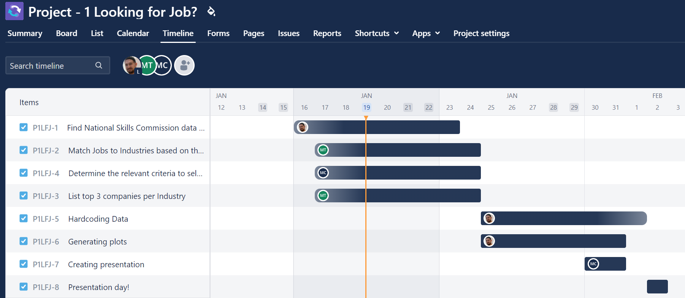
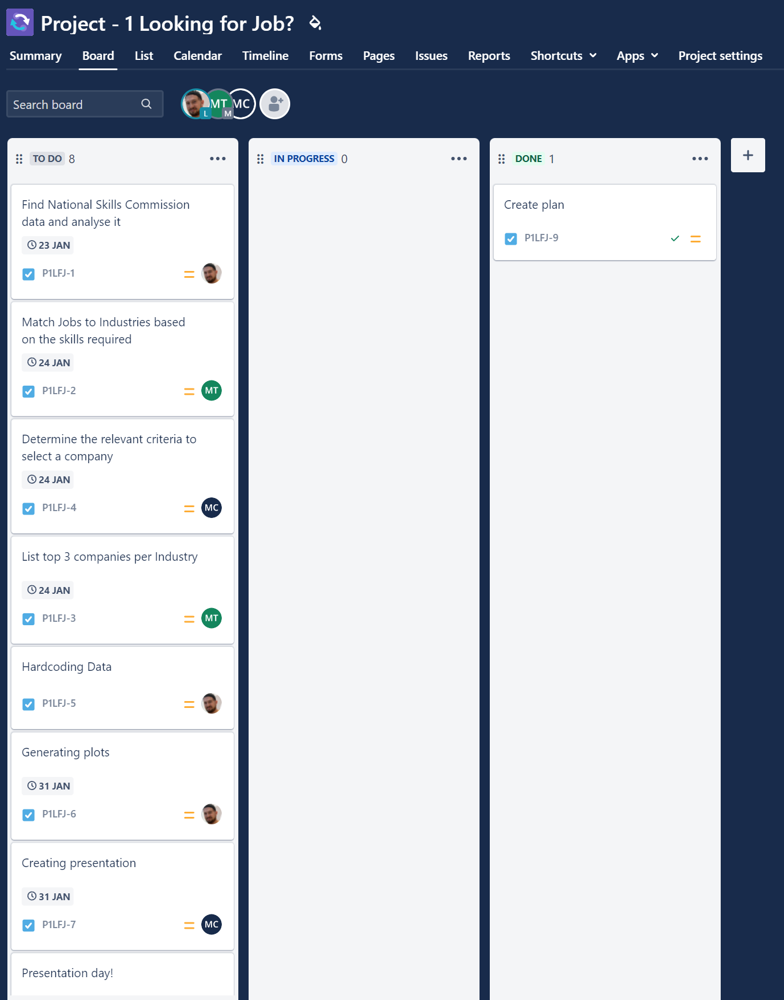

# Project-1---Looking-for-work-

# Project 1 - Looking for work?

To help people finding a potential employer based on their situation, data From the National Skills Commission of the Australian Government (https://www.nationalskillscommission.gov.au/topics/skills-priority-list), Determine the required Occupation titles, which have the skills that are in shortage and their National Future Demand Rating. This can be then matched with the current job offerings (Look for any type of API from Linkedin, Seek, Indeed, Glassdoor or alike). Then on a separate analysis check what the best companies are in terms of size, revenue, market share or any other relevant metric. Then match the 2 analyses to provide the best possible list of companies to apply for, given a set of competencies and aspirations a person would have in terms of what fulfils them in a company (Big, mid, small size company, company reputation, Job Security, etc)

## Submission

1. Submitted and available in GitHub under https://github.com/lcardsvr/Project-1---Looking-for-work-

